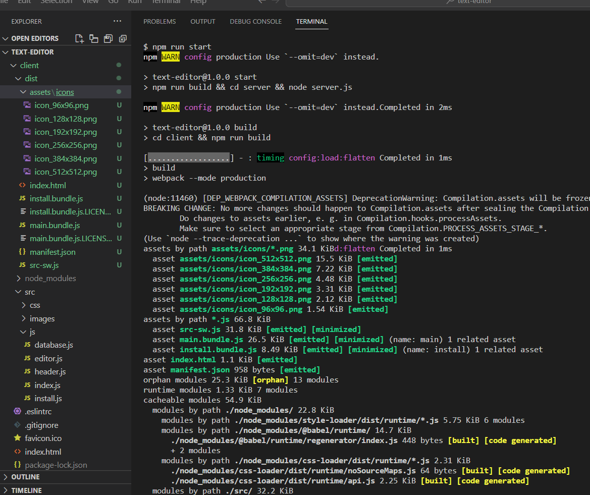
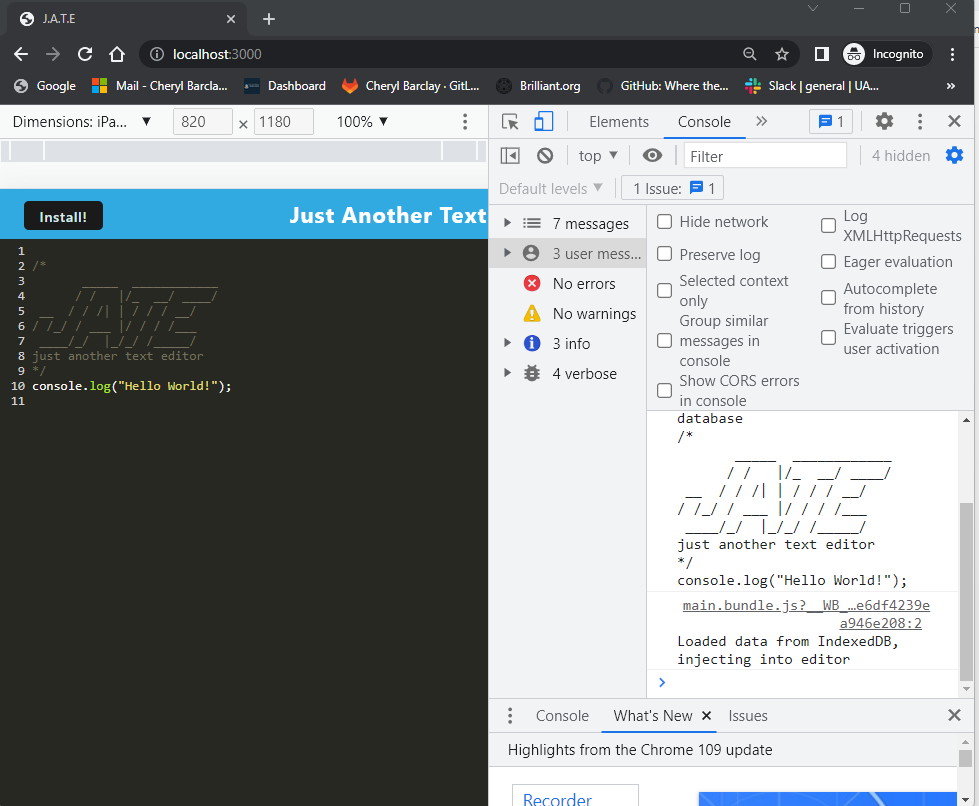
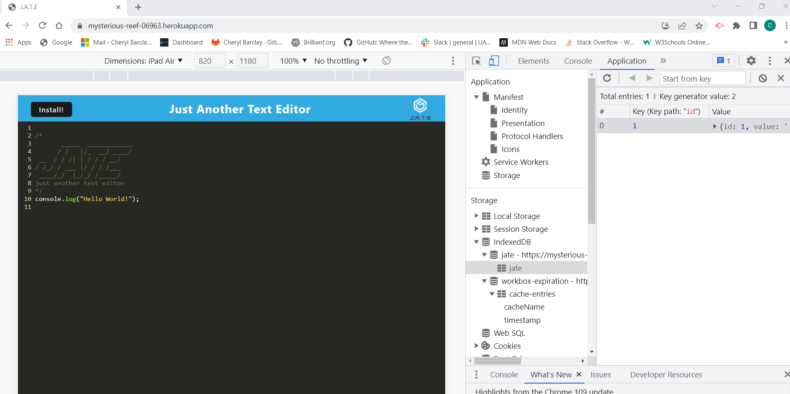

<h1 align="center"> Text Editor </h1>

<p align="center">
    
    
    
    
</p>

## Table of Contents
* [Description](#description)
* [User Story](#user-story)
* [Acceptance Criteria](#acceptance-criteria)
* [Screenshots](#screenshots)
* [Technology](#technology) 
* [Installation](#installation) 
* [Usage](#usage) 
* [Features](#features)
* [Heroku Link](#heroku-link)
* [Contact Me](#contact-me)
* [Credits](#credits) 
* [Questions](#questions)
* [License](#license)

## Description
This Text Editor is a Progressive Web Application (PWA). It runs in the browser, and features a number of data persistence techniques that serve as redundancy in case one of the options is not supported by the browser. The application will also function offline.
 
## User Story
AS A developer<br>
I WANT to create notes or code snippets with or without an internet connection<br>
SO THAT I can reliably retrieve them for later use<br>
 
## Acceptance Criteria
GIVEN a text editor web application<br>
WHEN I open my application in my editor<br>
THEN I should see a client server folder structure<br>
WHEN I run `npm run start` from the root directory<br>
THEN I find that my application should start up the backend and serve the client<br>
WHEN I run the text editor application from my terminal<br>
THEN I find that my JavaScript files have been bundled using webpack<br>
WHEN I run my webpack plugins<br>
THEN I find that I have a generated HTML file, service worker, and a manifest file<br>
WHEN I use next-gen JavaScript in my application<br>
THEN I find that the text editor still functions in the browser without errors<br>
WHEN I open the text editor<br>
THEN I find that IndexedDB has immediately created a database storage<br>
WHEN I enter content and subsequently click off of the DOM window<br>
THEN I find that the content in the text editor has been saved with IndexedDB<br>
WHEN I reopen the text editor after closing it<br>
THEN I find that the content in the text editor has been retrieved from our IndexedDB<br>
WHEN I click on the Install button<br>
THEN I download my web application as an icon on my desktop<br>
WHEN I load my web application<br>
THEN I should have a registered service worker using workbox<br>
WHEN I register a service worker<br>
THEN I should have my static assets pre cached upon loading along with subsequent pages and static assets<br>
WHEN I deploy to Heroku<br>
THEN I should have proper build scripts for a webpack application.

## Screenshots




## Technology
This project has been created with:

- Javascript
- Node.js
- Express.js
- Webpack
- Babel
- IndexedDB / IDB

## Installation
To setup the application in local, run `npm i` to install the packages listed in the package.json files. 

## Usage
After installing npm packages, the application will be invoked by using the following command:

```
npm run start
```

## Features
* Uses IndexedDB to create an object store and includes both GET and PUT methods.
* The application works without an internet connection.
* Automatically saves content inside the text editor when the DOM window is unfocused. 
* Bundled with webpack.
* Creates a service worker with workbox that Caches static assets.
* The application uses babel in order to use async / await.
* Application uses a generated manifest.json using the WebpackPwaManifest plug-in.
* Can be installed as a Progressive Web Application

## Heroku Link
[Click here for Heroku Link](https://mysterious-reef-06963.herokuapp.com)
 
## Contact Me
* GitHub: [CheBar1](https://github.com/CheBar1)
* Email: findme@gmail.com

## Credits
* University of Adelaide - Coding Bootcamp;
* GitHub;
* Youtube.com;

## Questions
Please send your questions [here](mailto:findme@gmail.com?subject=[GitHub]%20Dev%20Connect) or visit [github/CheBar1](https://github.com/CheBar1).

## License
[](https://opensource.org/licenses/MIT) <br>
This project is licensed under MIT, for more information please visit [this website](https://opensource.org/licenses/MIT)
